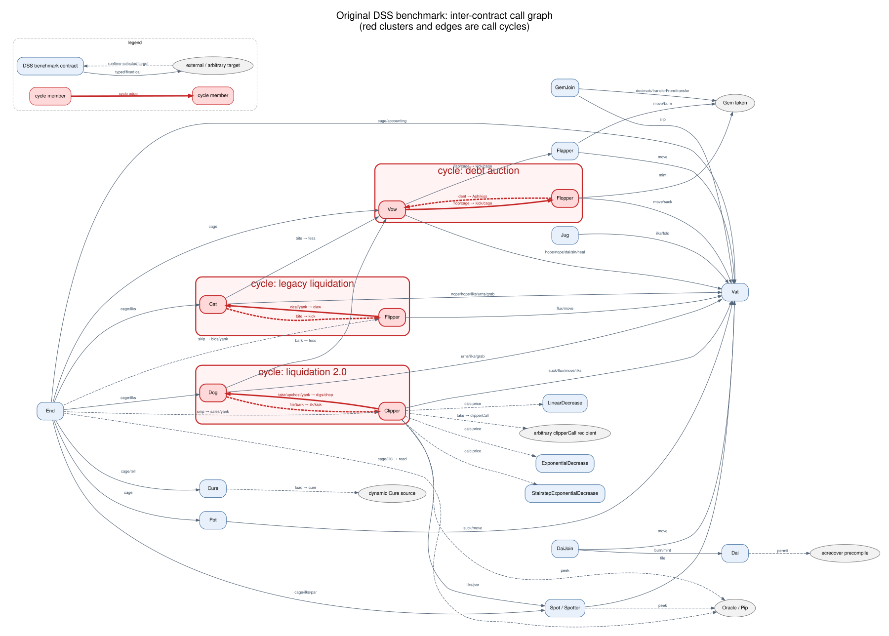

# Original DSS call graph

The graph is derived from direct external calls in the original Solidity files
under `Benchmarks/Dss/*/contracts`. Solid edges are calls through ordinary typed
contract references. Dashed edges have runtime-selected targets: per-ilk auction
houses and oracles, configurable calculators, auction participants, or arbitrary
callback/source addresses. Merely passing an address to another call does not
create an edge; for example, `Jug` and `Pot` store a Vow address but do not invoke
Vow themselves.

## Cycles

The red strongly connected components are:

1. `Cat → Flipper → Cat`: Cat starts the configured per-ilk Flipper in
   [`bite`](../Dss/Cat/contracts/cat.sol#L135), and Flipper calls `Cat.claw` from
   [`deal` and `yank`](../Dss/Flipper/contracts/flip.sol#L183).
2. `Dog → Clipper → Dog`: Dog starts the configured per-ilk Clipper in
   [`bark`](../Dss/Dog/contracts/dog.sol#L170), while Clipper calls `Dog.digs` or
   `Dog.chop` from `take`, `upchost`, and
   [`yank`](../Dss/Clipper/contracts/clip.sol#L466).
3. `Vow → Flopper → Vow`: Vow starts and cages Flopper in
   [`flop` and `cage`](../Dss/Vow/contracts/vow.sol#L141). During the first bid,
   Flopper treats the current bidder as a Vow-like contract and calls `Ash` and
   [`kiss`](../Dss/Flopper/contracts/flop.sol#L142). This reverse edge is
   runtime-dependent, but is the normal DSS wiring when the initial bidder is
   Vow.

These cycles explain why an Act system cannot simply contain the complete
original definitions. The standalone reductions cut the reverse edge in the
leaf copy used by each system.

The editable source is [`original-dss-call-graph.dot`](original-dss-call-graph.dot).
